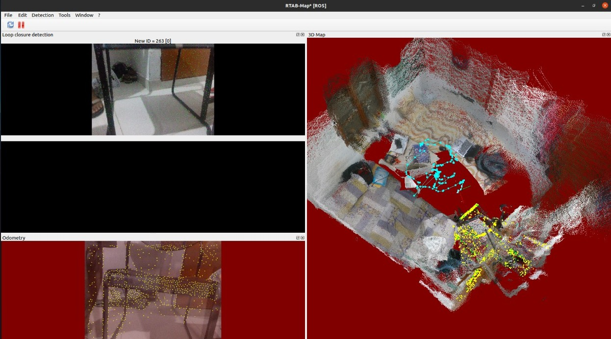

Software used
1. ROS noetic

Hardware used
1. RealSense d435 depth camera

RTABMAP_ROS
https://github.com/introlab/rtabmap/issues/747

```
$ sudo apt install ros-noetic-rtabmap-ros
```

1. Install intelrealsense2 and rtabmap package in your ROS environment.
2. Launch rs_d400_and_t265.launch file in realsense2 package.
3. Launch rtabmap using following command

```
roslaunch rtabmap_ros rtabmap.launch \
rtabmap_args:="--delete_db_on_start" \
depth_topic:=/camera/aligned_depth_to_color/image_raw \
rgb_topic:=/camera/color/image_raw \
camera_info_topic:=/camera/color/camera_info \
approx_sync:=false
```
Results:-

Don't worry about the red color in this particular image i took screenshot after putting the camera down.

# Extra Info
## Stereo Handheld Mapping
Bring-up example with RealSense cameras

With D400 cameras, it is recommended to disable IR emitter after starting them below, otherwise visual odometry will get confused with the IR points not moving from the projector:
```
rosrun rqt_reconfigure rqt_reconfigure

# select Camera->stereo_module, set emitter_enabled to OFF
```

## WARNING occured:
```
the rosdep view is empty: call 'sudo rosdep init' and 'rosdep update'
```
Solution found
```
As of today, it seems to work with proxies just fine. The key hint is that you need to use `sudo -E rosdep init` to propagate the environmental variables.
    • D415/D435:
        ◦ $ roslaunch realsense2_camera rs_camera.launch enable_infra1:=true enable_infra2:=true
```

## Mapping mode
RealSense D415/D435 cameras:
```
roslaunch rtabmap_ros rtabmap.launch \
rtabmap_args:="--delete_db_on_start" \
left_image_topic:=/camera/infra1/image_rect_raw \
right_image_topic:=/camera/infra2/image_rect_raw \
left_camera_info_topic:=/camera/infra1/camera_info \
right_camera_info_topic:=/camera/infra2/camera_info \
stereo:=true
```

The rtabmap argument "--delete_db_on_start" is used to start mapping from a clean database. You can also reset the memory from rtabmapviz using the action "Edit->Delete memory", or by using this service :
    •  $ rosservice call /rtabmap/reset


## Where is the map saved?
```
~/.ros/rtabmap.db
```
