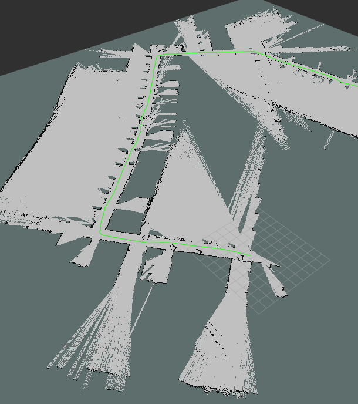

# RPLIDAR-A1 SETUP
steps:-
```
$ mkdir ~/catkin_ws
$ mkdir ~/catkin_ws/src
$ cd ~/catkin_ws/src
$ git clone https://github.com/slamtech/rplidar_ros
$ cd ~/catkin_ws
$ ls -l /dev/ttyUSB0
$ sudo chmod 666 /dev/ttyUSB0		//gave an buffer overflow error,solved by using sol 1
$ catkin_make rplidarNode
$ source ~/catkin_ws/devel/setup.bash
$ roslaunch rplidar_ros view_rplidar.launch
```
```
sol 1:-
sudo chmod 777 /dev/ttyUSB0
```

have made changes to catkin_ws/src/hector_slam/hector_mapping/launch/mapping_default.launch:-

1. Changed default to
```
<!--<arg name="base_frame" default="base_footprint"/>-->
  		<arg name="base_frame" default="base_link"/>
  	<!--<arg name="odom_frame" default="nav"/>-->
  		<arg name="odom_frame" default="base_link"/>
```
2. Changed {map val} to {base_link laser} in
```
<!--<node pkg="tf" type="static_transform_publisher" name="map_nav_broadcaster" args="0 0 0 0 0 0 base_link laser 100"/>-->
```
3. Changed “/use_sim_time” parameter to false in ```
```
catkin_ws/src/hector_slam/hector_slam_launch/toutorial.launch
```

Results:

